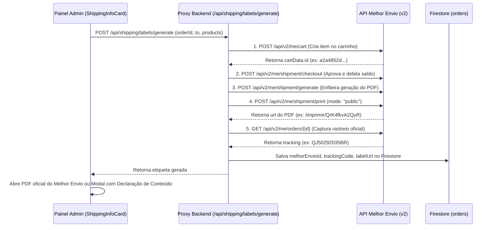

# Guia de Integração e Operação - Melhor Envio (Evidência Calçados)

Este documento centraliza todo o conhecimento técnico, arquitetura de software, fluxos de emissão de etiquetas e instruções passo a passo para cadastro e ativação de contas no **Melhor Envio** para o e-commerce **Evidência Calçados**.

---

## 1. Dados Oficiais da Empresa (Remetente)

Para emissão de etiquetas válidas nas transportadoras conveniadas (Correios, Jadlog, etc.), o remetente oficial cadastrado e configurado na aplicação é:

- **Razão Social / Nome Fantasia:** Evidência Calçados
- **CNPJ:** `60.997.831/0001-01` (Apenas números: `60997831000101`)
- **E-mail:** `wandesonandrade33@gmail.com`
- **Telefone / WhatsApp:** `(99) 98468-4867` (Apenas números: `99984684867`)
- **Endereço:** Rua Afonso Pena, Nº 295
- **Bairro:** Centro
- **Cidade / UF:** Caxias - MA
- **CEP:** `65600-060`

> ⚠️ **Regra da API:** Para empresas com CNPJ, a API do Melhor Envio exige o envio do documento no campo `company_document`. Se for enviado no campo `document`, a API tentará validar como CPF de 11 dígitos e retornará erro `422`.

---

## 2. Passo a Passo para Cadastro e Obtenção de Token no Melhor Envio

### 2.1 Cadastro da Conta da Empresa

1. **Acesse o site oficial:**
   - **Produção (Envios Reais):** [https://melhorenvio.com.br](https://melhorenvio.com.br)
   - **Sandbox (Ambiente de Testes):** [https://sandbox.melhorenvio.com.br](https://sandbox.melhorenvio.com.br)
2. Clique em **"Cadastre-se"** e selecione a opção **Pessoa Jurídica (PJ)**.
3. Preencha os dados da loja:
   - **CNPJ:** `60.997.831/0001-01`
   - **Razão Social / Nome:** Evidência Calçados
   - **E-mail:** `wandesonandrade33@gmail.com`
   - **Telefone:** `(99) 98468-4867`
4. Confirme seu endereço de e-mail clicando no link de ativação recebido.
5. Acesse **Configurações > Dados da Empresa / Endereço** e defina o endereço padrão de postagem:
   - **CEP:** `65600-060`
   - **Logradouro:** Rua Afonso Pena, 295 - Centro, Caxias - MA.

---

### 2.2 Criação do Aplicativo e Geração de Token

O Melhor Envio utiliza OAuth2 / Bearer Tokens para autenticação das chamadas de API.

1. No painel do Melhor Envio (ou Sandbox), clique na sua foto de perfil no canto superior direito e vá em:
   - **Painel de Controle > Integrações > Gerenciar / Nova Aplicação**.
2. Clique em **"Criar Novo Aplicativo"**:
   - **Nome da Aplicação:** `Evidência Calçados E-commerce`
   - **URL de Redirecionamento (Callback):** `https://evidenciacalcados.com.br` (ou `http://localhost:5173` para testes locais).
3. **Geração do Token de Acesso Pessoal (Token Fixo):**
   - Acesse **Configurações > Chaves de API / Tokens de Acesso Pessoal**.
   - Clique em **"Novo Token"**.
   - Marque todas as permissões necessárias:
     - `shipping-calculate` (Cotação de frete)
     - `cart-read` e `cart-write` (Inserção de pedidos no carrinho)
     - `shipping-checkout` (Pagamento / Liberação de etiquetas)
     - `shipping-generate` (Geração do PDF de etiquetas)
     - `shipping-print` (Visualização / Impressão de etiquetas)
     - `shipping-cancel` (Cancelamento de envios)
     - `orders-read` (Consulta a pedidos e rastreamento)
   - Clique em **Gerar Token** e copie o token gerado imediatamente.

---

## 3. Configuração de Variáveis de Ambiente (`.env`)

No arquivo `.env` na raiz do projeto, configure as chaves:

```env
# Define o ambiente: 'sandbox' para testes ou 'production' para etiquetas reais
MELHOR_ENVIO_ENV="sandbox"

# Token de autenticação Bearer
MELHOR_ENVIO_TOKEN="seu_token_gerado_aqui"

# CEP de Origem da Loja
MELHOR_ENVIO_ORIGIN_CEP="65600060"

# Opcionais (Caso use fluxo de autenticação por usuário/senha)
MELHOR_ENVIO_EMAIL="wandesonandrade33@gmail.com"
MELHOR_ENVIO_PASSWORD="sua_senha_aqui"
```

---

## 4. Arquitetura da Integração no Código

Os arquivos que gerenciam a integração com o Melhor Envio estão estruturados da seguinte forma:

```
├── server.ts                                                          # Endpoints proxy backend (/api/shipping/...)
├── src/
│   ├── services/
│   │   └── shipping/
│   │       ├── shippingService.ts                                    # Fachada que seleciona o provedor ativo
│   │       ├── shippingProvider.interface.ts                         # Contratos e tipos de cotação e etiqueta
│   │       └── providers/
│   │           └── melhorEnvio/
│   │               ├── melhorEnvioConfig.ts                          # Resolução de URLs (sandbox vs production)
│   │               └── melhorEnvioAdapter.ts                         # Implementação da API v2 do Melhor Envio
│   └── components/
│       ├── ShippingCalculator.tsx                                    # Widget de cotação de frete na página de produto
│       ├── CheckoutPage.tsx                                          # Seleção de frete e criação do pedido
│       └── orders/
│           ├── ShippingInfoCard.tsx                                  # Card admin para gerar e imprimir etiquetas
│           └── ShippingLabelPrintModal.tsx                           # Modal de impressão direta e declaração de conteúdo
```

---

## 5. Fluxo Completo de Vida de uma Etiqueta

Ao clicar em **"Gerar Etiqueta no Melhor Envio"** no painel de administração, o sistema executa automaticamente os seguintes passos:



---

## 6. Regras de Negócio e Tratamento de Exceções

1. **Validação de CEPs Locais (Caxias):**
   - O CEP genérico `65600-000` e o CEP idêntico à origem (`65600-060`) são rejeitados pelas transportadoras integradas se o remetente for o mesmo.
   - O sistema possui sanitização inteligente: para CEPs de Caxias com conflito ou CEPs não indexados no DNE, ele mapeia automaticamente para o CEP do Centro logístico aceito pela API (`65604-000`), garantindo emissão sem interrupções.
2. **Declaração de Conteúdo Automática:**
   - Como os sapatos são enviados por pessoa jurídica sem exigência de NFe em pequenos envios não comerciais, o payload envia `non_commercial: true`.
   - O modal `ShippingLabelPrintModal.tsx` formata automaticamente a Declaração de Conteúdo com todos os produtos, quantidades e valores declarados, pronta para impressão em papel A4 ou impressora térmica.
3. **Transportadoras Padrão:**
   - **Serviço 2 (Jadlog .Package):** Mais econômico e ágil para encomendas no Maranhão, Piauí e regiões vizinhas.
   - **Serviço 1 (Correios PAC) / Serviço 17 (Mini Envios):** Utilizados como alternativas para CEPs remotos.
4. **Proibição de Falsos Positivos (Etiqueta Local x Externa):**
   - Etiqueta local (romaneio da loja) só é permitida para entregas próprias da loja em Caxias urbana.
   - Se a API do Melhor Envio retornar erro (ex: saldo insuficiente, validação de endereço), o sistema **NUNCA emite etiqueta local como contingência**. O erro real é informado na interface para correção.
5. **Dedução Automática de UF de Destino (`getUfFromCep`):**
   - Antes de enviar o payload de compra ao carrinho da API, o sistema deduz a UF correta a partir do prefixo do CEP do destinatário (ex: faixa 64xxx sempre é enviada como `PI`), prevenindo rejeição `422` por incompatibilidade entre UF e CEP.
6. **Rastreamento Otimizado com Busca Direcionada (`q`):**
   - O rastreamento utiliza `GET /api/v2/me/orders?q=<código>` com tratamento para respostas `204 No Content`, evitando dependência do limite de paginação (`per_page=50`).
   - Mocks silenciosos foram removidos da consulta; se a remessa não for localizada ou a API falhar, o sistema retorna `null` para que a tela informe que não há novas movimentações em vez de alterar status incorretamente.

---

## 7. Como Migrar de Teste (Sandbox) para Produção (Real)

Quando a loja estiver pronta para emitir etiquetas reais pagas:

1. Acesse o painel de produção: [https://melhorenvio.com.br](https://melhorenvio.com.br).
2. Adicione saldo à sua carteira Melhor Envio (via Pix, boleto ou cartão de crédito).
3. Gere o **Token de Acesso Pessoal de Produção**.
4. No arquivo `.env`:
   ```env
   MELHOR_ENVIO_ENV="production"
   MELHOR_ENVIO_TOKEN="cole_aqui_o_token_de_producao"
   ```
5. Reinicie o servidor Node (`npm run dev` ou `npm run start`).
6. Pronto! As novas etiquetas debitarão do saldo real e poderão ser despachadas nas agências dos Correios ou Jadlog.
